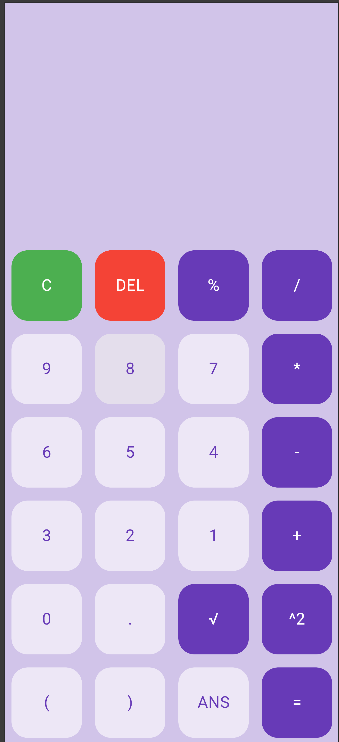

# 📱 Flutter Calculator

🚀 A beautifully designed, highly functional,
and incredibly user-friendly calculator application created using the Flutter framework. 
This app is perfect for anyone looking for a reliable and efficient tool for performing calculations. 


## ✨ Features & Skills

- 🧮 **Basic Arithmetic**: Addition, Subtraction, Multiplication, Division
- 🎯 **Advanced Operations**: Percentage, Square, Square Root, Power
- 🔢 **Memory Function**: Answer Memory (ANS) for quick recall
- 🛠 **Custom Widgets**: Reusable UI components for efficiency
- ⚡ **Optimized Performance**: Smooth UI and fast execution
- 🎭 **User-Friendly Interface**: Intuitive button layout and responsive design

---

## 🏗 Widgets Used

### 📌 Layout & Structure
- 🏛️ **Scaffold** - Provides the basic app structure
- 📐 **Column & Row** - Arranges components in a structured layout
- 🔢 **GridView.builder** - Dynamically creates the button grid
- 🧩 **SliverGridDelegateWithFixedCrossAxisCount** - Defines the button grid structure

### 🎨 Styling & Design
- 📦 **Container** - Wraps elements for styling and spacing
- 🔲 **ClipRRect** - Rounds button edges for a smooth look
- 📏 **Padding & SizedBox** - Manages spacing between elements
- 🎨 **Material & InkWell** - Adds ripple effects for button feedback
- 🎭 **Align** - Aligns text and widgets properly
- 🎨 **DecoratedBox** - Customizes the button styles
- 🖼️ **BoxDecoration** - Adds color, border radius, and styling to widgets

### ⌨️ User Interaction
- 🤖 **GestureDetector** - Detects button taps for user interaction
- 🎯 **InkResponse** - Provides visual feedback for taps

### 🔠 Text & Display
- ✍️ **Text & TextStyle** - Displays numbers, symbols, and results
- 📜 **RichText** - Enhances text presentation

---

## 📂 Project Structure

```
📦 flutter_calculator
┣ 📂 lib
┃ ┣ 📜 main.dart  (Main application logic)
┃ ┣ 📜 buttons.dart  (Custom button widget)
┣ 📜 pubspec.yaml  (Dependencies & configurations)
```

---

## 📸 Screenshots

| Calculator UI |
| ------------- |
|  |

---

## 🛠️ Technologies Used

- 🟦 **Flutter** - Framework for building the UI
- 🎯 **Dart** - Programming language for Flutter apps
- 🧮 **Math Expressions Package** - Evaluates mathematical expressions

---

## 🚀 Installation & Setup

### Prerequisites

- Install [Flutter](https://flutter.dev/docs/get-started/install)
- Install [Dart](https://dart.dev/get-dart)

### Installation

1. Clone the repository:
   ```sh
   git clone https://github.com/yourusername/flutter_calculator.git
   ```
2. Navigate to the project directory:
   ```sh
   cd flutter_calculator
   ```
3. Install dependencies:
   ```sh
   flutter pub get
   ```
4. Run the app:
   ```sh
   flutter run
   ```

---

## 🌟 Why I Created This

💡 I built this calculator app to enhance my Flutter skills and create a practical, visually appealing, and efficient tool. The goal was to implement essential mathematical functions while optimizing UI responsiveness and user experience. This project helped me gain hands-on experience with:

- 🏗 **Widget structuring and layout management**
- 🎭 **Gesture handling for a smooth UI**
- 🧮 **Mathematical expression evaluation using Dart**
- 🎨 **Styling and UI customization with Flutter components**

I hope you find this project useful and inspiring! ✨🚀
